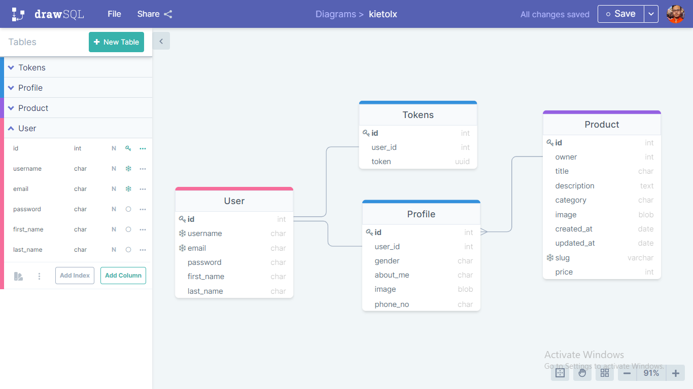

<h1><center>kietOLX</center></h1>

## 1. Clone this repository locally
```sh
git clone https://github.com/g-paras/kietOLX.git
cd kietOLX
```

## 2. Frontend Setup
> Make sure you are in parent folder (kietOLX)
```sh
cd kietOLX-frontend
npm install
npm start
```

## 3. Backend Setup
> Make sure you are in parent folder (kietOLX)
```sh
cd kietOLX-backend
pip install -m requirements.txt
python manage.py runserver
```

## DataBase Schema

